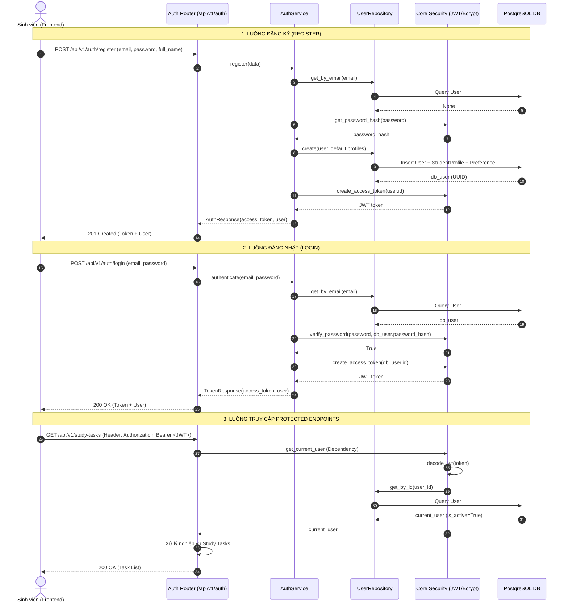

# Authentication API Architecture Proposal & Implementation Plan

> **Project:** FocusBuddy Backend (`be/`)  
> **Status:** `PROPOSAL — NOT IMPLEMENTED`  
> **Author:** Senior Backend Architect  
> **Date:** 23/08/2026  
> **Scope:** Identity, Authentication, and User Resolution Layer  

---

## 1. Executive Summary & Context

Hệ thống FocusBuddy Backend hiện đã hoàn thiện tái cấu trúc kiến trúc theo định hướng **Agent System V2 / Dynamic Composition Architecture** (FastAPI 3-tier: Router $\to$ Service $\to$ Repository $\to$ PostgreSQL Database).

Tuy nhiên, cơ chế định danh người dùng trên toàn bộ hệ thống hiện vẫn là **Development-Only Mock Identity** thông qua HTTP Header `X-User-Id` (hoặc `x-user-id`). Cơ chế này tồn tại các lỗ hổng bảo mật nghiêm trọng (mạo danh tùy ý chỉ bằng cách đổi UUID trên header, không có xác thực mật khẩu khi đăng nhập, không có token lifecycle, và phân mảnh trong cách bắt header giữa các router).

Tài liệu này trình bày thiết kế kiến trúc chuẩn **Production Authentication API**, thiết kế **Centralized Dependency (`get_current_user`)**, lộ trình di trú an toàn từ `X-User-Id` sang chuẩn **OAuth2 Bearer JWT**, và **Kế hoạch triển khai chi tiết từng bước (Implementation Plan)** sẵn sàng để review và phê duyệt.

> [!IMPORTANT]
> **Quy tắc thi hành:** Tài liệu này là **Đề xuất Kiến trúc (Design Proposal)**. Tuyệt đối **KHÔNG** thực hiện thay đổi mã nguồn hoặc migration database trước khi được phê duyệt chính thức.

---

## 2. Current State Audit (Khảo sát Hiện trạng)

### 2.1. Hiện trạng User Model & Credentials
* **Model Class:** `User` ([be/app/models/module_1_user_management/user.py](file:///d:/DUT%20AI%20CLUB/PROJECT/FORCUS_BUDDY/FocusBuddy/be/app/models/module_1_user_management/user.py))
  * `id`: `UUID` (Primary Key, default `uuid.uuid4`)
  * `email`: `String(255)` (Unique, Not Null, Index)
  * `password_hash`: `Text` (Not Null)
  * `full_name`: `String(100)` (Not Null)
  * `avatar_url`: `Text` (Nullable)
  * `phone_number`: `String(20)` (Nullable)
  * `is_active`: `Boolean` (Default `True`, Not Null)
  * `created_at`: `DateTime` (Default `utcnow`)
  * `updated_at`: `DateTime` (Default `utcnow`, onupdate `utcnow`)
  * Relationships: `student_profile` (1-1), `user_preference` (1-1).
* **Mật khẩu & Mã hóa:** 
  * [be/app/core/security.py](file:///d:/DUT%20AI%20CLUB/PROJECT/FORCUS_BUDDY/FocusBuddy/be/app/core/security.py) đã có sẵn hàm `get_password_hash` và `verify_password` sử dụng `bcrypt`.
  * Khi tạo user qua `UserService.create_user`, mật khẩu đã được băm bằng `bcrypt` và lưu vào cột `password_hash`.
  * **Khoảng trống:** Chưa có hàm verify password trong bất kỳ flow nghiệp vụ nào vì thiếu endpoint login.

### 2.2. Hiện trạng Sử dụng `X-User-Id` trên Toàn bộ Router
Toàn bộ các router người dùng hiện đang parse `X-User-Id` độc lập, thiếu nhất quán và không kiểm tra sự tồn tại hay trạng thái `is_active` của User trong Database:

| Phân hệ (Domain) | File Router | Cơ chế Identity hiện tại | Kiểu dữ liệu / Alias | Rủi ro phát hiện |
| :--- | :--- | :--- | :--- | :--- |
| **Study Tasks** | `api/v1/study_tasks.py` | `x_user_id: UUID = Header(...)` | UUID (raw header) | Không verify DB, duplicate header parsing ở 5 endpoints |
| **Study Sessions** | `api/v1/study_sessions.py` | `x_user_id: UUID = Header(...)` | UUID (raw header) | Không verify DB, duplicate header parsing ở 5 endpoints |
| **Learning Goals** | `api/v1/learning_goals.py` | `x_user_id: UUID = Header(...)` | UUID (raw header) | Không verify DB, duplicate header parsing ở 5 endpoints |
| **Grades** | `api/v1/grades.py` | `x_user_id: str = Header(..., alias="X-User-Id")` | String (alias `X-User-Id`) | Lệch kiểu dữ liệu (`str` vs `UUID`), không verify DB |
| **Academic Performance**| `api/v1/academic_performance.py` | `x_user_id: str = Header(..., alias="X-User-Id")` | String (alias `X-User-Id`) | Lệch kiểu dữ liệu (`str` vs `UUID`), không verify DB |
| **Emotion Logs** | `api/v1/emotion_logs.py` | `x_user_id: UUID = Header(..., description="User ID")` | UUID (description) | Không verify DB, duplicate header parsing ở 5 endpoints |
| **Mental Assessments** | `api/v1/mental_assessments.py` | `x_user_id: UUID = Header(..., description="User ID")` | UUID (description) | Không verify DB, duplicate header parsing ở 5 endpoints |
| **File Processing** | `api/v1/files.py` | `x_user_id: UUID = Header(..., description="User ID")` | UUID (description) | Không verify DB, duplicate header parsing ở 6 endpoints |
| **Notifications** | `api/v1/notifications.py` | `x_user_id: str = Header(..., alias="X-User-Id")` | String (alias `X-User-Id`) | Lệch kiểu dữ liệu (`str` vs `UUID`), không verify DB |
| **Chatbot / Agent** | `api/v1/chat.py` | `def get_user_id(x_user_id: UUID = Header(...))` | Helper function cục bộ | Chỉ parse UUID header, không kiểm tra session ownership |
| **AI Analysis** | `api/v1/ai_analysis.py` | `def get_user_id(x_user_id: UUID = Header(...))` | Helper function cục bộ | Không verify DB |
| **User CRUD** | `api/v1/user.py` | Không dùng header, dùng path param `{user_id}` | Path Parameter | Không có phân quyền, ai cũng có thể đọc/sửa/xóa user khác |

### 2.3. Các Vấn đề Kiến trúc Nghiêm trọng
1. **Thiếu Lớp Bảo vệ (No Authentication Boundary):** Bất kỳ ai cũng có thể gửi HTTP Request với UUID của người khác để xem điểm số, đọc lịch sử chat, hoặc xóa dữ liệu học tập.
2. **Frontend Buộc Phải Dùng Cơ Chế Giả Lập (Security Bypass):** Trang Login hiện tại bên Frontend phải gọi `GET /api/v1/users` để lấy danh sách tất cả người dùng, lọc email trùng khớp rồi lấy ID lưu vào `localStorage`. Điều này làm lộ toàn bộ danh sách sinh viên.
3. **Phân mảnh Dependency:** Không có dependency xác thực dùng chung. Các router tự khai báo `Header(...)` với kiểu dữ liệu không đồng nhất (`str` vs `UUID`), gây khó khăn khi bảo trì và viết kiểm thử.

---

## 3. Evaluation of Authentication Strategies (Đánh giá các Chiến lược)

### 3.1. Phương án A — JSON Web Token (JWT) Bearer Authentication *(Được Khuyến nghị)*
* **Mô tả:** Client gửi credentials (`email`, `password`) lên `/api/v1/auth/login`. Server xác thực và cấp phát `access_token` (JWT chứa `sub: user_id`, `email`, `exp`, `iat`). Client đính kèm `Authorization: Bearer <token>` trong các request tiếp theo.
* **Ưu điểm:**
  * Chuẩn RESTful không trạng thái (Stateless), hiệu năng cao, dễ mở rộng (scale horizontally).
  * Chuẩn hóa theo tiêu chuẩn FastAPI `OAuth2PasswordBearer` / `HTTPBearer`, tích hợp mượt mà với Swagger UI.
  * Tương thích hoàn hảo với Next.js SPA/SSG/SSR, Mobile App, Robot client trong tương lai.
* **Nhược điểm:** Khó thu hồi (revoke) token trước hạn nếu không dùng blacklist / Redis.
* **Giải pháp bổ trợ:** Đặt `ACCESS_TOKEN_EXPIRE_MINUTES` ngắn (ví dụ: 60 phút) kết hợp Refresh Token khi cần.

### 3.2. Phương án B — Server-Side Session với HttpOnly Cookies
* **Mô tả:** Server tạo session trong Redis / Database và gửi `Set-Cookie: session_id=...; HttpOnly; SameSite=Lax`.
* **Ưu điểm:** Thu hồi session tức thì, bảo vệ tốt chống tấn công XSS.
* **Nhược điểm:** 
  * Phức tạp hóa cấu hình CORS giữa Next.js Frontend (port 3000) và FastAPI Backend (port 8000).
  * Đòi hỏi giải pháp chống CSRF (CSRF tokens).
  * Kém linh hoạt khi kết nối từ các client không phải Browser (Robot Study Buddy, CLI tool, Mobile API).

### 3.3. Quyết định Kiến trúc: **JWT Bearer Token (Option A)**
FocusBuddy là nền tảng học tập đa thiết bị (Web App, AI Chatbot Assistant, và tiềm năng tích hợp Robot/IoT Client). Kiến trúc **JWT Bearer Token** hoàn toàn phù hợp nhất với cấu trúc FastAPI hiện tại, bảo đảm tính độc lập giữa FE và BE, giảm tải cho Database và chuẩn hóa theo hệ sinh thái OpenAPI.

---

## 4. Proposed Authentication API Contract (Thiết kế API Contract)

Tất cả các endpoint xác thực sẽ được nhóm trong router mới: `app.api.v1.auth` với tiền tố `/api/v1/auth`.

| Method | Path | Auth Requirement | Request Body / Params | Response Body / Status | Error Codes | Side Effects |
| :--- | :--- | :--- | :--- | :--- | :--- | :--- |
| `POST` | `/api/v1/auth/register` | None (Public) | `UserRegisterRequest` | `AuthResponse` (201 Created) | 400, 409, 422 | Tạo User, StudentProfile, UserPreference trong DB; Sinh token |
| `POST` | `/api/v1/auth/login` | None (Public) | `LoginRequest` (JSON) | `TokenResponse` (200 OK) | 400, 401, 403, 422 | Xác thực mật khẩu; Cấp phát access token |
| `POST` | `/api/v1/auth/token` | None (Public) | `OAuth2PasswordRequestForm` (Form) | `TokenResponse` (200 OK) | 400, 401, 422 | Hỗ trợ nút Authorize trực tiếp trên Swagger UI docs |
| `GET` | `/api/v1/auth/me` | Bearer Token | None | `UserResponse` (200 OK) | 401, 404 | Truy vấn thông tin user hiện tại từ Database |
| `POST` | `/api/v1/auth/logout` | Bearer Token | None | `MessageResponse` (200 OK) | 401 | Phía client xóa token; ghi nhận audit log |

---

## 5. Schema & Data Models Specification

### 5.1. Request & Response Schemas (`app/schemas/module_1_user_management/auth.py`)

```python
from pydantic import BaseModel, EmailStr, Field
from uuid import UUID
from datetime import datetime
from typing import Optional
from app.schemas.module_1_user_management.user import UserResponse

class LoginRequest(BaseModel):
    email: EmailStr = Field(..., description="Email đăng nhập của sinh viên")
    password: str = Field(..., min_length=6, description="Mật khẩu tài khoản")

class UserRegisterRequest(BaseModel):
    email: EmailStr = Field(..., description="Email của sinh viên")
    password: str = Field(..., min_length=6, description="Mật khẩu tối thiểu 6 ký tự")
    full_name: str = Field(..., min_length=2, max_length=100, description="Họ và tên sinh viên")
    phone_number: Optional[str] = Field(None, max_length=20, description="Số điện thoại liên hệ")
    avatar_url: Optional[str] = Field(None, description="Đường dẫn ảnh đại diện")

class TokenResponse(BaseModel):
    access_token: str = Field(..., description="JWT Access Token")
    token_type: str = Field("bearer", description="Loại token")
    expires_in: int = Field(..., description="Thời gian hết hạn tính bằng giây")
    user: UserResponse = Field(..., description="Thông tin tóm tắt của sinh viên")

class AuthResponse(TokenResponse):
    pass

class TokenPayload(BaseModel):
    sub: str # User ID (UUID string)
    email: Optional[str] = None
    exp: datetime
    iat: datetime
    type: str = "access"
```

---

## 6. Authentication Data Flows




---

## 7. Centralized Current User Dependency Design

Cốt lõi của việc chuyển đổi kiến trúc là đưa toàn bộ logic xác thực danh tính về một điểm duy nhất (**Single Source of Truth**) tại `app/api/dependencies.py`.

### 7.1. Dependency Hierarchy
1. **`get_current_user_optional`**: Đọc token nếu có, giải mã token. Nếu không có token, kiểm tra chế độ chuyển đổi (Migration Compatibility).
2. **`get_current_user`**: Yêu cầu bắt buộc phải có User hợp lệ và `is_active == True`. Trả về thực thể `User` ORM Model.
3. **`get_current_user_id`**: Dependency tiện ích trả về trực tiếp `UUID` của user từ `get_current_user`.

### 7.2. Đặc tả Logic Dependency (`app/api/dependencies.py`)

```python
from fastapi import Depends, HTTPException, status, Header
from fastapi.security import OAuth2PasswordBearer, HTTPBearer, HTTPAuthorizationCredentials
from sqlalchemy.orm import Session
from uuid import UUID
from typing import Optional

from app.core.database import SessionLocal
from app.core.config import settings
from app.core.security import decode_access_token
from app.models.module_1_user_management.user import User
from app.repositories.module_1_user_management.user_repository import UserRepository

oauth2_scheme = OAuth2PasswordBearer(
    tokenUrl="/api/v1/auth/token",
    auto_error=False
)

def get_db():
    db = SessionLocal()
    try:
        yield db
    finally:
        db.close()

def get_current_user(
    db: Session = Depends(get_db),
    token: Optional[str] = Depends(oauth2_scheme),
    # DUAL-MODE COMPATIBILITY: Hỗ trợ x-user-id trong giai đoạn chuyển đổi (nếu được bật)
    x_user_id: Optional[str] = Header(None, alias="X-User-Id")
) -> User:
    credentials_exception = HTTPException(
        status_code=status.HTTP_401_UNAUTHORIZED,
        detail="Could not validate credentials",
        headers={"WWW-Authenticate": "Bearer"},
    )
    
    # 1. Ưu tiên xác thực qua JWT Bearer Token
    if token:
        payload = decode_access_token(token)
        if payload is None or "sub" not in payload:
            raise credentials_exception
        try:
            user_id = UUID(payload["sub"])
        except ValueError:
            raise credentials_exception
            
        user = UserRepository(db).get_by_id(user_id)
        if user is None or not user.is_active:
            raise HTTPException(
                status_code=status.HTTP_401_UNAUTHORIZED,
                detail="User inactive or not found"
            )
        return user
        
    # 2. Migration Fallback: Nếu không có Bearer token nhưng có header X-User-Id
    if settings.ALLOW_DEV_HEADER_AUTH and x_user_id:
        try:
            user_id = UUID(x_user_id)
            user = UserRepository(db).get_by_id(user_id)
            if user and user.is_active:
                return user
        except ValueError:
            pass

    # 3. Từ chối nếu không có bất kỳ phương thức xác thực hợp lệ nào
    raise credentials_exception

def get_current_user_id(current_user: User = Depends(get_current_user)) -> UUID:
    return current_user.id
```

---

## 8. Migration Strategy (Lộ trình Chuyển đổi từ `X-User-Id`)

Để đảm bảo không làm gián đoạn (zero-downtime) hoạt động của Frontend và các tính năng đang phát triển, quá trình chuyển đổi tuân thủ 5 giai đoạn an toàn:

```
┌─────────────────────────────────────────────────────────────┐
│ Giai đoạn 1: Nền tảng Auth & Core Security (JWT Utilities)  │
└──────────────────────────────┬──────────────────────────────┘
                               │
┌──────────────────────────────▼──────────────────────────────┐
│ Giai đoạn 2: Khởi tạo Auth API (/api/v1/auth/*)              │
│ (Login, Register, Me hoạt động song song với hệ thống cũ)   │
└──────────────────────────────┬──────────────────────────────┘
                               │
┌──────────────────────────────▼──────────────────────────────┐
│ Giai đoạn 3: Triển khai Dual-Mode Dependency                │
│ (Chấp nhận cả Bearer Token và X-User-Id thông qua cờ config)│
└──────────────────────────────┬──────────────────────────────┘
                               │
┌──────────────────────────────▼──────────────────────────────┐
│ Giai đoạn 4: Di trú toàn bộ các Router nghiệp vụ            │
│ (Thay thế Header(...) thủ công bằng Depends(get_current_user))│
└──────────────────────────────┬──────────────────────────────┘
                               │
┌──────────────────────────────▼──────────────────────────────┐
│ Giai đoạn 5: Tắt Dev Header & Dọn dẹp Mock Auth             │
│ (ALLOW_DEV_HEADER_AUTH = False, chuẩn hóa 100% JWT)        │
└─────────────────────────────────────────────────────────────┘
```

* **Cơ chế An toàn (Safety Guard):** Biến môi trường `ALLOW_DEV_HEADER_AUTH=True` cho phép Frontend có thể đăng nhập bằng tài khoản nhận JWT token, trong khi các flow cũ vẫn chưa bị gãy ngay lập tức. Sau khi FE chuyển đổi xong toàn bộ sang Bearer token, biến này sẽ được đặt thành `False`.

---

## 9. Security & Configuration Design

### 9.1. Biến Môi Trường Cần Thêm vào `Settings` ([be/app/core/config.py](file:///d:/DUT%20AI%20CLUB/PROJECT/FORCUS_BUDDY/FocusBuddy/be/app/core/config.py))

```python
class Settings(BaseSettings):
    # Database & Redis ...
    DATABASE_URL: str
    
    # === Authentication Configurations ===
    AUTH_SECRET_KEY: str = "focusbuddy-super-secret-key-change-in-production-min-32-chars-long"
    AUTH_ALGORITHM: str = "HS256"
    ACCESS_TOKEN_EXPIRE_MINUTES: int = 60 * 24 # 1 ngày (mặc định)
    ALLOW_DEV_HEADER_AUTH: bool = True # True trong giai đoạn Migration, False trên Production
```

### 9.2. Nguyên tắc Bảo mật
1. **Password Security:** Sử dụng thuật toán `bcrypt` với muối ngẫu nhiên (work factor 12).
2. **Token Security:** Ký JWT bằng HMAC-SHA256 với khóa bí mật tối thiểu 256-bit (`AUTH_SECRET_KEY`).
3. **Information Leakage Prevention:** Thông báo lỗi đăng nhập trả về chung: `"Invalid email or password"` (tránh user enumeration attack).
4. **CORS Headers:** Bảo đảm `Authorization` nằm trong danh sách `allow_headers` của CORS Middleware.

---

## 10. Database Impact Analysis

* **Trường Mật khẩu (`password_hash`):** ĐÃ CÓ SẴN trên bảng `users` $\implies$ **Không cần thêm cột**.
* **Trường Trạng thái (`is_active`):** ĐÃ CÓ SẴN trên bảng `users` $\implies$ **Không cần thêm cột**.
* **Đánh giá Migration:** **KHÔNG YÊU CẦU THAY ĐỔI DATABASE SCHEMA (ZERO SCHEMA MIGRATION)**. Cấu trúc bảng `users` hiện tại đã hoàn toàn sẵn sàng cho hệ thống JWT.

---

## 11. Detailed Implementation Plan (Kế hoạch Triển khai Từng Bước)

Kế hoạch được chia thành 6 task nhỏ, có tính cô lập và kiểm thử độc lập:

### [AUTH-01] Core Security & Configuration Extension
* **Mục tiêu:** Bổ sung cấu hình JWT và các hàm mã hóa/giải mã token vào tầng `core`.
* **Files thay đổi:**
  * MODIFY: `be/app/core/config.py` (Thêm `AUTH_SECRET_KEY`, `AUTH_ALGORITHM`, `ACCESS_TOKEN_EXPIRE_MINUTES`, `ALLOW_DEV_HEADER_AUTH`).
  * MODIFY: `be/app/core/security.py` (Bổ sung `create_access_token`, `decode_access_token`).
  * MODIFY: `be/pyproject.toml` (Thêm `pyjwt>=2.8.0`).
* **Rủi ro:** `LOW` (Không ảnh hưởng router hiện có).
* **Kiểm thử:** Unit test tạo và giải mã JWT token với các trường hợp hợp lệ, hết hạn, và sai secret key.

---

### [AUTH-02] Auth Schemas & Repository Preparation
* **Mục tiêu:** Định nghĩa đầy đủ các schema Pydantic cho Authentication và bổ sung hàm truy vấn nếu cần.
* **Files thay đổi:**
  * NEW: `be/app/schemas/module_1_user_management/auth.py` (`LoginRequest`, `UserRegisterRequest`, `TokenResponse`, `TokenPayload`).
  * MODIFY: `be/app/repositories/module_1_user_management/user_repository.py` (Bảo đảm `get_by_email` và `get_by_id` tối ưu index).
* **Rủi ro:** `LOW`.
* **Kiểm thử:** Pydantic validation test trên các payload hợp lệ và không hợp lệ.

---

### [AUTH-03] Authentication Service Layer
* **Mục tiêu:** Cung cấp nghiệp vụ đăng nhập, đăng ký, cấp phát token và lấy thông tin cá nhân.
* **Files thay đổi:**
  * NEW: `be/app/services/module_1_user_management/auth_service.py`
    * `register(db, data)`: Kiểm tra trùng email, băm mật khẩu, tạo user + profiles, sinh token.
    * `authenticate(db, email, password)`: Kiểm tra email, verify mật khẩu, kiểm tra `is_active`, sinh token.
    * `get_me(db, user_id)`: Lấy thông tin user hiện tại.
* **Rủi ro:** `LOW`.
* **Kiểm thử:** Service unit test mô phỏng đăng ký thành công, trùng email, đăng nhập sai mật khẩu, đăng nhập tài khoản bị khóa.

---

### [AUTH-04] Authentication API Router & Swagger Integration
* **Mục tiêu:** Expose các endpoint `/api/v1/auth/register`, `/api/v1/auth/login`, `/api/v1/auth/token`, `/api/v1/auth/me`.
* **Files thay đổi:**
  * NEW: `be/app/api/v1/auth.py` (Implement các route với status code chuẩn).
  * MODIFY: `be/app/api/router.py` (Include `auth.router` với prefix `/v1/auth`, tags `["Authentication"]`).
* **Rủi ro:** `LOW` (Thêm endpoint mới, không sửa endpoint cũ).
* **Kiểm thử:** Chạy kiểm thử API qua HTTP client / pytest trên các endpoint `/auth/*`.

---

### [AUTH-05] Centralized Current User Dependency
* **Mục tiêu:** Triển khai `get_current_user` và `get_current_user_id` hỗ trợ Dual-Mode trong `app/api/dependencies.py`.
* **Files thay đổi:**
  * MODIFY: `be/app/api/dependencies.py` (Viết `get_current_user`, `get_current_user_id`, `oauth2_scheme`).
* **Rủi ro:** `MEDIUM` (Cần bảo đảm logic fallback `X-User-Id` hoạt động chính xác khi chưa có Bearer token).
* **Kiểm thử:** Test dependency với Bearer token hợp lệ, Bearer token giả, `X-User-Id` hợp lệ, và trường hợp không có cả hai.

---

### [AUTH-06] Migration of Existing Business Domain Routers
* **Mục tiêu:** Thay thế các khai báo `x_user_id: UUID = Header(...)` rời rạc ở tất cả các router nghiệp vụ bằng `user_id: UUID = Depends(get_current_user_id)`.
* **Files thay đổi:**
  * MODIFY: `be/app/api/v1/study_tasks.py`
  * MODIFY: `be/app/api/v1/study_sessions.py`
  * MODIFY: `be/app/api/v1/learning_goals.py`
  * MODIFY: `be/app/api/v1/grades.py`
  * MODIFY: `be/app/api/v1/academic_performance.py`
  * MODIFY: `be/app/api/v1/emotion_logs.py`
  * MODIFY: `be/app/api/v1/mental_assessments.py`
  * MODIFY: `be/app/api/v1/files.py`
  * MODIFY: `be/app/api/v1/notifications.py`
  * MODIFY: `be/app/api/v1/chat.py`
  * MODIFY: `be/app/api/v1/ai_analysis.py`
* **Rủi ro:** `MEDIUM` (Cần bảo đảm không làm thay đổi contract dữ liệu đầu ra của router).
* **Kiểm thử:** Chạy toàn bộ integration test suite của các domain để xác nhận vẫn hoạt động trơn tru với cả Bearer token và dev header.

---

## 12. Checkpoints & Rollback Strategy

### Checkpoints
* **CHECKPOINT 1 (Foundation):** `AUTH-01` & `AUTH-02` hoàn tất, thư viện PyJWT sẵn sàng, config nạp đúng.
* **CHECKPOINT 2 (Auth Endpoints):** `AUTH-03` & `AUTH-04` hoàn tất, đăng ký và đăng nhập trả về Token thành công trên Swagger `/docs`.
* **CHECKPOINT 3 (Dependency Ready):** `AUTH-05` hoàn tất, `get_current_user` verify thành công token và fallback header.
* **CHECKPOINT 4 (System Migration):** `AUTH-06` hoàn tất, 100% router nghiệp vụ sử dụng `get_current_user_id`.

### Rollback Strategy
* Do không có thay đổi về cấu trúc Database (không thêm cột, không sửa migration), việc rollback mã nguồn hoàn toàn an toàn:
  1. Nếu router nghiệp vụ gặp lỗi: Khôi phục lại file router tương ứng về commit trước đó.
  2. Nếu hệ thống cần duy trì hỗ trợ client cũ: Giữ `ALLOW_DEV_HEADER_AUTH=True` trong file `.env`.

---

## 13. Documentation Strategy

1. **Tài liệu Canonical Mới:** Tạo tài liệu [be/docs/AUTHENTICATION.md](file:///d:/DUT%20AI%20CLUB/PROJECT/FORCUS_BUDDY/FocusBuddy/be/docs/AUTHENTICATION.md) sau khi implementation hoàn tất để giải thích chi tiết cơ chế JWT, API contract và hướng dẫn tích hợp.
2. **Cập nhật Tài liệu Cũ:**
   * Cập nhật [be/docs/api/user-api.md](file:///d:/DUT%20AI%20CLUB/PROJECT/FORCUS_BUDDY/FocusBuddy/be/docs/api/user-api.md) để khớp hoàn toàn với `/api/v1/auth/login` và `/api/v1/auth/register`.
   * Cập nhật [be/docs/api/frontend-integration.md](file:///d:/DUT%20AI%20CLUB/PROJECT/FORCUS_BUDDY/FocusBuddy/be/docs/api/frontend-integration.md) chuyển hướng dẫn từ `X-User-Id` sang `Authorization: Bearer <token>`.
   * Cập nhật [fe/docs/FE_BE_API_CONTRACT.md](file:///d:/DUT%20AI%20CLUB/PROJECT/FORCUS_BUDDY/FocusBuddy/fe/docs/FE_BE_API_CONTRACT.md) đánh dấu trạng thái Authentication thành `MATCHED` sau khi tích hợp.

---

## 14. Open Questions & Design Decisions Requiring Approval

1. **Thời hạn Access Token (`ACCESS_TOKEN_EXPIRE_MINUTES`):** Đề xuất mặc định là **1440 phút (24 giờ)** để thuận tiện cho trải nghiệm học tập của sinh viên trong giai đoạn hiện tại. Có cần rút ngắn xuống 60 phút kèm Refresh Token endpoint ngay trong giai đoạn này không?
2. **Quy định Phân quyền / Roles:** Hiện tại hệ thống xem mọi tài khoản đăng ký là Student. Các chức năng Admin (quản lý trường học, danh mục môn) sẽ phân quyền dựa trên trường `role` hay sẽ xử lý trong một task mở rộng riêng biệt?
