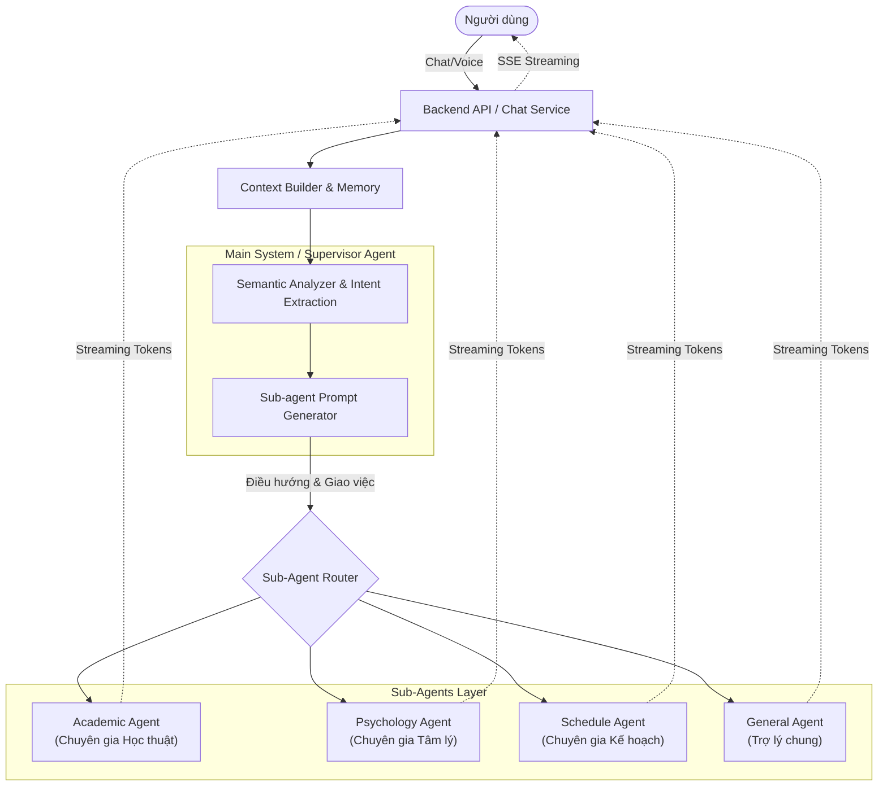

# KIẾN TRÚC MULTI-AGENT CHO FOCUSBUDDY

Tài liệu này đề xuất cấu trúc tổng thể cho hệ thống AI Agent của FocusBuddy theo mô hình **Supervisor-Worker (Main System & Sub-Agents)**. Cấu trúc này tối ưu cho việc cá nhân hóa, dễ mở rộng và đáp ứng tốt yêu cầu xử lý đa tác vụ với phản hồi Streaming.

---

## 1. TỔNG QUAN KIẾN TRÚC (OVERALL ARCHITECTURE)

Hệ thống được chia làm 3 lớp chính:
1. **Memory & Context Layer**: Quản lý lịch sử chat và hồ sơ học sinh (điểm số, tâm lý).
2. **Main System (Supervisor/Router Agent)**: Chịu trách nhiệm phân tích, điều hướng và giao việc. Lớp này cần chạy cực nhanh (không streaming).
3. **Sub-Agents (Worker Agents)**: Chịu trách nhiệm thực thi tác vụ chuyên sâu và trực tiếp stream kết quả về cho Frontend.

Xem sơ đồ minh họa tại đây: [Diagram](AGENT-ARCHITETURE-DIAGRAM.png)

---

## 2. THIẾT KẾ CHI TIẾT TỪNG MODULE

### 2.1. Main System (Supervisor Agent)
Đây là bộ não điều phối của toàn bộ hệ thống. Nhiệm vụ của nó KHÔNG PHẢI là trả lời người dùng, mà là **hiểu người dùng muốn gì** và **giao việc cho ai**. 

**Quy trình hoạt động:**
1. **Semantic Analysis (Phân tích ngữ nghĩa)**: Nhận `User Prompt` + `Recent Chat History`. Sử dụng một model LLM nhỏ gọn và nhanh (vd: GPT-4o-mini, Haiku) hoặc kỹ thuật function calling để phân loại Intent (Ý định).
2. **Feature Extraction (Trích lọc đặc trưng)**: Nhận diện các Keyword quan trọng (ví dụ: "buồn", "điểm thấp", "toán rời rạc", "lịch học").
3. **Agent Selection**: Dựa vào Intent, chọn ra 1 Sub-agent duy nhất (hoặc 1 Pipeline gồm nhiều Agent) để xử lý.
4. **Prompt Generation (Tạo Prompt)**: Sinh ra một `System Prompt` động dành riêng cho Sub-agent được chọn. Prompt này chứa:
   - Vai trò của Sub-agent.
   - Ngữ cảnh của học sinh (được trích xuất từ DB).
   - Chỉ thị cụ thể (Ví dụ: *"Học sinh đang buồn vì điểm Toán. Hãy đóng vai chuyên gia tâm lý an ủi và khích lệ."*)

*Lưu ý: Quá trình này diễn ra hoàn toàn ở Background và phải cực nhanh (dưới 1 giây).*

### 2.2. Các Sub-Agents (Worker Agents)
Mỗi Sub-agent là một module độc lập, có System Prompt mặc định, có các công cụ (Tools) riêng và chịu trách nhiệm xử lý mảng nghiệp vụ chuyên biệt. Khi nhận được Prompt từ Main, Sub-agent tiến hành sinh câu trả lời và **Streaming trực tiếp** về Backend Router.

#### A. Academic Agent (Chuyên gia Học thuật & Điểm số)
- **Chức năng**: Phân tích điểm, tư vấn phương pháp học, giải đáp bài tập, vạch lộ trình cải thiện GPA.
- **Tools/RAG (Tương lai)**: Truy cập Database điểm thi của sinh viên, truy vấn kho tài liệu môn học.
- **Đặc điểm**: Giọng văn chuyên nghiệp, khách quan, logic, mang tính hướng dẫn (Mentor).

#### B. Psychology Agent (Chuyên gia Tâm lý)
- **Chức năng**: An ủi, lắng nghe, giảm stress, giải tỏa áp lực học hành/cuộc sống cho sinh viên.
- **Tools/RAG**: Đánh giá lịch sử cảm xúc của sinh viên trong 7 ngày qua.
- **Đặc điểm**: Giọng văn đồng cảm, nhẹ nhàng, thấu hiểu. Tuyệt đối không phán xét, không đưa ra lời khuyên y tế chuyên sâu mà chỉ định hướng tư duy tích cực.

#### C. Schedule & Action Agent (Chuyên gia Lập kế hoạch)
- **Chức năng**: Xây dựng thời gian biểu, nhắc nhở deadline, tạo task list (To-do list).
- **Tools**: Gọi API thêm sự kiện vào Calendar, tạo Task trong hệ thống FocusBuddy.
- **Đặc điểm**: Năng động, gãy gọn, tập trung vào hành động (Action-oriented).

#### D. General Agent (Trợ lý chung / Fallback)
- **Chức năng**: Chào hỏi, chit-chat thông thường, hoặc xử lý các câu hỏi không nằm trong 3 mục trên.
- **Đặc điểm**: Giọng điệu thân thiện, giống như một người bạn đồng hành (Focus Buddy).

---

## 3. LUỒNG THỰC THI (DATA FLOW) VÀ STREAMING

Vấn đề lớn nhất của kiến trúc Agent là UX (thời gian chờ). Để giải quyết bài toán Streaming như ChatGPT, luồng thực thi sẽ như sau:

1. **User** gửi message: `"Mình vừa biết điểm thi môn Toán Rời Rạc, có 3 điểm thôi, mình nản quá không muốn học nữa..."`
2. **Backend API** gọi `Main System` (Synchronous nhưng dùng Model cực nhanh).
3. **Main System** phân tích:
   - *Intent*: Vừa có yếu tố "Điểm số" (Toán rời rạc), vừa có yếu tố "Tâm lý" (nản, buồn).
   - *Decision*: Chọn **Psychology Agent** làm chủ đạo, phụ trợ thông tin từ **Academic Agent** (Hoặc chỉ chuyển cho Psychology Agent).
   - *Generated Prompt*: `"Đóng vai chuyên gia tâm lý. Người dùng vừa thi rớt Toán Rời Rạc và đang tuyệt vọng. Hãy an ủi họ trước, sau đó khuyên họ bình tĩnh lại để tìm cách cải thiện điểm. Không giảng đạo."`
4. **Backend API** khởi tạo kết nối Streaming (Server-Sent Events - SSE) về cho Frontend.
5. **Backend API** gọi `Psychology Agent` với Prompt trên và truyền thẳng `user_message`.
6. `Psychology Agent` bắt đầu gọi LLM Provider (ví dụ: Gemini/OpenAI) ở chế độ `stream=True`.
7. Mỗi khi LLM Provider nhả ra 1 chữ (chunk), Backend lập tức `yield` chữ đó về cho Frontend.
8. Frontend hiển thị chữ chạy liên tục trên màn hình. Khi stream kết thúc, Backend gom toàn bộ chữ lại và lưu vào PostgreSQL (Message History).

---

## 4. ƯU NHƯỢC ĐIỂM VÀ LỘ TRÌNH TRIỂN KHAI

### Ưu điểm:
- **Phân tách trách nhiệm (Separation of Concerns)**: Mỗi Agent chỉ lo một việc, giúp Prompt ngắn gọn hơn, LLM ít bị ảo giác (hallucination) hơn.
- **Dễ mở rộng**: Sau này có thể thêm các Agent mới (Ví dụ: `EnglishTutorAgent`, `JobInterviewAgent`) mà không ảnh hưởng tới core.
- **UX xuất sắc**: Đảm bảo phản hồi dạng Streaming liên tục tới người dùng, không bị đứt quãng.

### Lộ trình triển khai (Đề xuất):
- **Giai đoạn 1**: Xây dựng Main System dùng LLM (GPT-4o-mini) chỉ để phân loại Intent thành chuỗi JSON. Dựng cứng (Hardcode) 4 Sub-agents dưới dạng các Class Python cơ bản.
- **Giai đoạn 2**: Đưa cơ chế "Tự gen Prompt" vào Main System để nó linh hoạt truyền lệnh cho Sub-agents.
- **Giai đoạn 3**: Gắn thêm Tools (Function Calling) cho các Sub-agents để chúng thực sự tương tác được với Database/Hệ thống thay vì chỉ sinh ra Text.
