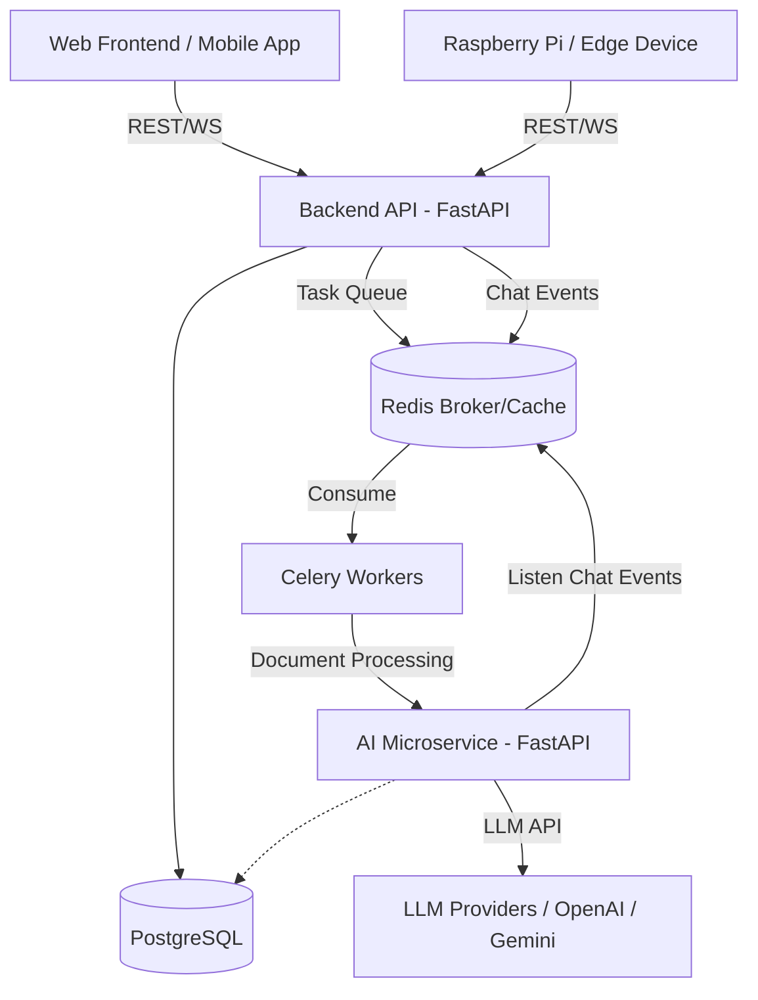

# PROJECT AUDIT AND ROADMAP: FOCUSBUDDY

## 1. Executive Summary
Sau quá trình technical audit toàn diện repository `FocusBuddy`, hệ thống hiện tại đang ở giai đoạn **Functional MVP (Backend-heavy)**.
Phần Backend (FastAPI + PostgreSQL) đã được hoàn thiện rất tốt về mặt Database Schema (đã map 32 models) và các API endpoints cơ bản. Tuy nhiên, phần Frontend (Next.js) và sự liên kết thực tế với tầng AI/LLM vẫn còn đang dang dở.
Tầng AI (được tách thành một microservice riêng) hiện tại tập trung chủ yếu vào tính năng OCR thông qua Vision LLM (như Gemini hoặc Custom LLM), trong khi đó `PaddleOCR` vẫn chỉ là placeholder. Các logic về AI Chatbot hay AI Analysis hiện tại đang được code cứng dạng MOCK ở Backend thay vì đẩy sang AI microservice.

## 2. Repository Structure
Cấu trúc repository được phân chia rõ ràng theo kiến trúc Microservices/Monorepo cơ bản:
- `be/`: Backend chính (FastAPI, SQLAlchemy, Alembic, Celery).
- `fe/`: Frontend (Next.js, React, TailwindCSS).
- `ai/`: AI Microservice (FastAPI, LLM Clients, Prompts, OCR Extractors).
- `docs/`: Tài liệu kiến trúc và system design.
- `docker-compose.yml`: Quản lý toàn bộ stack gồm PostgreSQL, Redis, Backend, Frontend, Celery Worker, và AI.

## 3. Current Architecture
Kiến trúc hiện tại đang hoạt động theo mô hình:
```text
FE (Next.js) 
 │
 ▼
BE (FastAPI) ──► PostgreSQL
 │      │
 ▼      ▼
Redis  AIProvider (MOCK)
 │
 ▼
Celery Worker
```
Lưu ý: Tầng `ai/` hiện tại đang chạy độc lập (cổng 8100) và expose API `/api/v1/ocr/extract-transcript`. Backend chưa thực sự gọi vào microservice này cho các tác vụ Chat và Analysis (đang dùng class `AIProvider` ở BE trả về mock data).

## 4. Module Status

| Module             | Status | Existing Implementation | Missing | Priority |
| ------------------ | ------ | ----------------------- | ------- | -------- |
| Frontend           | PARTIAL| UI khung, auth, router  | Gần như toàn bộ UI features | High |
| Backend            | DONE   | 32 models, 17 routers   | Kết nối thực tế với AI Service | High |
| Database           | DONE   | Schema đầy đủ, foreign keys | Seed data, index tuning | Medium |
| Authentication     | TODO   | Routers có tồn tại      | Logic JWT, Session mapping | High |
| Academic           | PARTIAL| CRUD endpoints          | Logic thống kê tính điểm phức tạp | Medium |
| Learning Activity  | PARTIAL| CRUD endpoints          | Tích hợp phân tích thói quen học tập | Medium |
| Learning Analytics | TODO   | -                       | Dashboard aggregations | Low |
| Chatbot            | PARTIAL| API + DB schema         | Kết nối LLM thực tế (đang MOCK)| High |
| LLM                | PARTIAL| Vision LLM cho OCR      | Text generation LLM cho chatbot| High |
| Agent              | TODO   | Orchestrator MOCK ở BE  | Agentic workflow thực tế ở AI service | High |
| OCR                | PARTIAL| VLM (Gemini/Custom)     | PaddleOCR (đang là placeholder) | Medium |
| Redis              | PARTIAL| Config sẵn, healthcheck | Queue cho AI Message Broker | High |
| Celery             | PARTIAL| Config worker chạy sẵn  | Các background task thực tế | Medium |
| Docker             | DONE   | Compose hoàn chỉnh      | Production optimization | Low |
| Testing            | TODO   | -                       | Unit tests, E2E tests | Medium |
| Documentation      | PARTIAL| Các file .md thiết kế   | API docs chi tiết, deployment guide | Low |
| Raspberry Pi       | FUTURE | -                       | Script chạy trên Edge | Low |
| Edge AI            | FUTURE | -                       | Mô hình quantized | Low |
| Voice              | FUTURE | -                       | STT/TTS | Low |
| Computer Vision    | FUTURE | -                       | Face/Emotion recognition | Low |

## 5. Backend Audit
- **Kiến trúc**: Rất tốt. Cấu trúc layer rõ ràng: `api` -> `services` -> `repositories` -> `models`.
- **Database**: Đã map đủ 32 bảng, xử lý tốt các quan hệ phức tạp (Self-referencing, N-N).
- **Vấn đề**: `AIProvider` và `AgentOrchestrator` đang được đặt bên trong source `be/` thay vì đẩy hoàn toàn logic này sang `ai/`. Hiện tại `AIProvider` đang trả về mock data.

## 6. Frontend Audit
- **Kiến trúc**: Next.js App Router.
- **Hiện trạng**: Đã setup các thư mục `features` (auth, chatbot, dashboard, schedule, scores) nhưng bên trong chưa có implementation chi tiết.
- **Vấn đề**: UI/UX chưa hình thành. Thiếu state management phức tạp để duy trì session chat và context của user.

## 7. AI/LLM Audit
- **Cấu trúc**: Microservice riêng biệt (cổng 8100).
- **LLM Client**: Hỗ trợ Custom OpenAI-compatible và Gemini. Quản lý timeout/retry khá tốt qua thư viện requests.
- **Prompt Layer**: Hệ thống prompt được tách riêng khá tốt (`ai/app/prompts/system.py`).
- **Agent Layer**: Thư mục `ai/app/modules/agents` đang rỗng. Orchestrator hiện đang nằm cứng ở Backend.
- **Data Access**: AI service hiện chưa tự truy cập vào Database. BE phải gửi context (chuỗi string) sang cho AI. Điều này dễ dẫn đến nghẽn băng thông nếu context quá lớn.

## 8. OCR Audit
- **Pipeline**: User Upload -> FastAPI -> Tiền xử lý ảnh (Resize/Enhance) -> Vision LLM -> JSON -> Pydantic Schema.
- **Đánh giá**: Hoạt động tốt với VLM. Tuy nhiên VLM tốn kém chi phí.
- **Vấn đề**: `PaddleOCRExtractor` chưa được implement (chỉ là class rỗng throw error). OCR nên là input pipeline chạy dưới background (Celery) thay vì synchronous API.

## 9. Redis/Celery Audit
- **Redis**: Đã có container và config `CELERY_BROKER_URL`.
- **Celery**: Container `celery_worker` đã chạy.
- **Vấn đề**: Backend chưa đưa bất kỳ task tốn thời gian nào (như OCR hay Report Generation) vào Celery. Tất cả đang chạy đồng bộ (synchronous).

## 10. Database Audit
- **Schema**: Rất chi tiết, bao quát đủ các thông tin (Academic, Mental Health, Learning Goals).
- **LLM Context**: Đủ dữ liệu để LLM hiểu được User. `AIContextBuilder` đã được viết để query dữ liệu này gom thành text context.

## 11. Testing Audit
- Toàn bộ project chưa có test (Unit/Integration). Đối với AI app, đây là một rủi ro lớn (hallucination, validation, format errors).

## 12. Deployment Audit
- **Docker Compose**: Sẵn sàng để chạy ở môi trường dev (`docker compose up`).
- Trạng thái chưa đủ độ "production-ready" (thiếu reverse proxy như Nginx, chưa quản lý secret tốt, `.env` đang lưu lung tung).

## 13. Robot/Raspberry Pi Direction
Kiến trúc hiện tại (Microservices via Docker) RẤT PHÙ HỢP để mở rộng.
**Định hướng**:
- Backend, Database, Redis, Celery chạy trên **Cloud/Server**.
- Phần cứng Raspberry Pi 4 đóng vai trò là **Edge Device** thu thập I/O (Mic, Speaker, Camera).
- Raspberry Pi kết nối với Backend thông qua **WebSocket** (để truyền stream audio/text thời gian thực) và **MQTT** (để nhận lệnh từ AI).
- LLM chạy trên Cloud (do Pi4 quá yếu để chạy LLM đủ thông minh).
- Wakeword (ví dụ: "Hey FocusBuddy") và Voice Activity Detection chạy **Local Edge** trên Pi.

## 14. Architecture Problems & Technical Debt
1. **AI Logic nằm sai chỗ**: Logic build prompt và orchestrator đang nằm ở `be/app/services/ai/`. Điều này phá vỡ mục đích tách riêng `ai/` microservice. Cần refactor dời toàn bộ logic LLM sang `ai/`.
2. **Synchronous OCR**: API trích xuất điểm hiện đang là API đồng bộ. Nếu ảnh nặng hoặc LLM phản hồi chậm, request sẽ timeout. Cần chuyển sang Celery Task.
3. **Mock Data**: Chatbot và Analysis đang trả mock data.

## 15. Missing Features
- Tích hợp Message Broker (Redis) giữa Backend và AI Service (như trong doc architecture đã mô tả ở Task 4).
- Giao diện Frontend hoàn chỉnh.
- Real Implementation cho LLM Chatbot (Không mock).

## 16. Target Architecture


## 17. Development Roadmap

- **PHASE 1 — AI Integration & Refactor**: Dời toàn bộ logic Orchestrator và AIProvider từ Backend sang thư mục `ai/`. Cấu hình Backend gọi AI service qua HTTP hoặc Redis. Xóa bỏ Mock.
- **PHASE 2 — Asynchronous Processing**: Đẩy tiến trình OCR và AI Analysis vào Celery worker. API trả về `task_id` thay vì chờ kết quả.
- **PHASE 3 — Core Frontend UI**: Xây dựng UI cho Dashboard, Upload điểm, Chatbot UI. Kết nối với Backend API.
- **PHASE 4 — Agentic AI Implementation**: Viết code thực tế cho các agent (Study, Psychology) trong AI microservice, có khả năng dùng Tool Calling.
- **PHASE 5 — Edge AI & Raspberry Pi**: Xây dựng client script (Python) chạy trên Pi. Tích hợp STT/TTS và kết nối WebSocket với server.

## 18. Must Have / Should Have / Future

| Feature | Priority | Reason |
| ------- | --------- | ------ |
| Real LLM Chatbot | Must Have | Core value của FocusBuddy |
| Frontend UI cơ bản | Must Have | Không có UI không thể test được luồng người dùng |
| Redis Pub/Sub cho AI | Should Have | Tăng tốc độ và giảm coupling giữa BE và AI |
| Asynchronous OCR (Celery) | Should Have | Tránh timeout request |
| Local PaddleOCR | Future | Tiết kiệm tiền API LLM, nhưng chưa cấp bách |
| Robot Voice Interaction | Future | Vision dài hạn, không cần cho MVP web |

## 19. Next 5 Tasks

**NEXT TASK #1: Dời logic AI từ Backend sang AI Microservice**
- Tách `AIContextBuilder`, `AgentOrchestrator`, và `AIProvider` ra khỏi BE và đem vào source code `ai/`. Cập nhật lại router để gọi sang AI microservice thay vì gọi hàm nội bộ.

**NEXT TASK #2: Loại bỏ Mock Data, thay bằng API Request thực tế tới LLM**
- Cập nhật hàm `generate_chat_response` để kết nối vào LLM model thực (Gemini hoặc custom).

**NEXT TASK #3: Triển khai Giao tiếp Redis giữa Backend và AI Service (Task 4 trong doc)**
- Thiết lập Pub/Sub hoặc Redis Queue để BE gửi message vào hàng đợi, AI service lắng nghe, xử lý rồi trả kết quả về hàng đợi cho BE (WebSocket update cho FE).

**NEXT TASK #4: Hoàn thiện Frontend Chatbot UI**
- Dựng giao diện hộp thoại Chat trên Next.js để user có thể thực sự gửi tin nhắn và test luồng từ FE -> BE -> Redis -> AI -> LLM -> Trả về FE.

**NEXT TASK #5: Chuyển đổi OCR Pipeline sang Background Task (Celery)**
- Cập nhật API trích xuất điểm thành Async task.

## 20. Risks
- Chi phí API của Vision LLM cho chức năng OCR sẽ rất tốn kém nếu hệ thống scale lên. Cần sớm có Local OCR.
- Token window overflow: Khi người dùng học thời gian dài, context của họ ở DB sẽ rất lớn. Đẩy toàn bộ context vào prompt sẽ bị tràn token. Cần giải pháp RAG hoặc Memory Summarization.

## 21. Final Recommendation
> "FocusBuddy hiện đang ở giai đoạn **Early MVP (Nghiêng về Backend)**. Điểm nghẽn lớn nhất hiện tại là sự thiếu liên kết thực tế giữa Backend và tầng AI (hiện đang dùng Mock) và Frontend chưa có UI. Nếu tiếp tục phát triển đúng hướng, FocusBuddy nên trở thành một kiến trúc **Event-Driven AI Microservices** (sử dụng Redis làm xương sống giao tiếp) trong 3–6 tháng tới, tạo tiền đề hoàn hảo để cắm các thiết bị IoT/Robot vào sau này."
