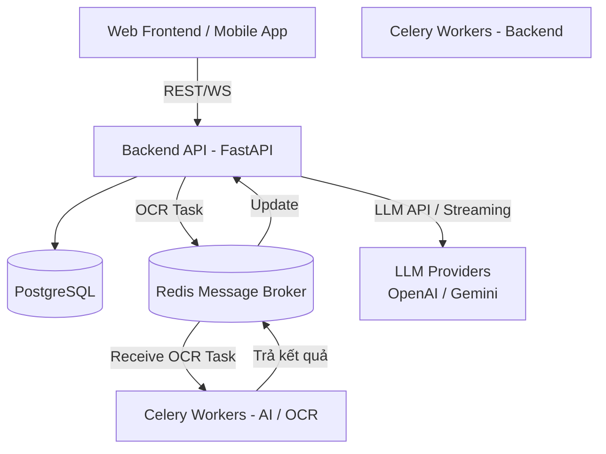

# Kiến trúc FocusBuddy

Tài liệu này mô tả kiến trúc tổng quát của hệ thống FocusBuddy sau khi đã cấu trúc lại (Refactor) để tối ưu tốc độ phản hồi Chatbot.

## 1. Architecture Hiện tại

Hệ thống được thiết kế theo kiến trúc Microservices hướng sự kiện (Event-driven) và tác vụ nền (Background jobs), đảm bảo tốc độ phản hồi API cực nhanh và chịu tải tốt với các tác vụ nặng (OCR).

- **Frontend**: Giao diện người dùng (Next.js).
- **Backend**: Xử lý API, logic kinh doanh. Tích hợp trực tiếp các Agent và LLM Prompts để phản hồi Chatbot theo dạng Streaming cực nhanh, không qua bước trung gian.
- **PostgreSQL**: Lưu trữ dữ liệu chính.
- **Redis**: Đóng vai trò làm message broker để Backend giao tiếp và gửi task xuống Celery.
- **Celery Worker (Backend)**: Xử lý các tác vụ nền của BE.
- **Celery Worker (AI OCR)**: Dịch vụ tách biệt chuyên xử lý trích xuất điểm từ hình ảnh/PDF (sử dụng PaddleOCR hoặc Vision LLM).

## 2. Lợi ích của Kiến trúc Mới

- **Giảm Latency Chatbot**: Chatbot không cần phải gọi qua 1 layer HTTP API trung gian. Backend gọi trực tiếp LLM Provider (OpenAI, Gemini).
- **Truy cập Context tức thời**: Các Agents nằm tại Backend giúp truy xuất DB qua SQLAlchemy nhanh chóng để build Context, tránh tuần tự hóa dữ liệu lớn giữa các Microservices.
- **Cách ly tác vụ nặng**: OCR tốn nhiều tài nguyên CPU/RAM. Giữ OCR ở microservice riêng (`ai/`) và giao tiếp qua Redis (Celery) giúp Backend luôn rảnh rỗi để phục vụ API, tránh sập server khi có lượng request OCR tăng đột biến.
