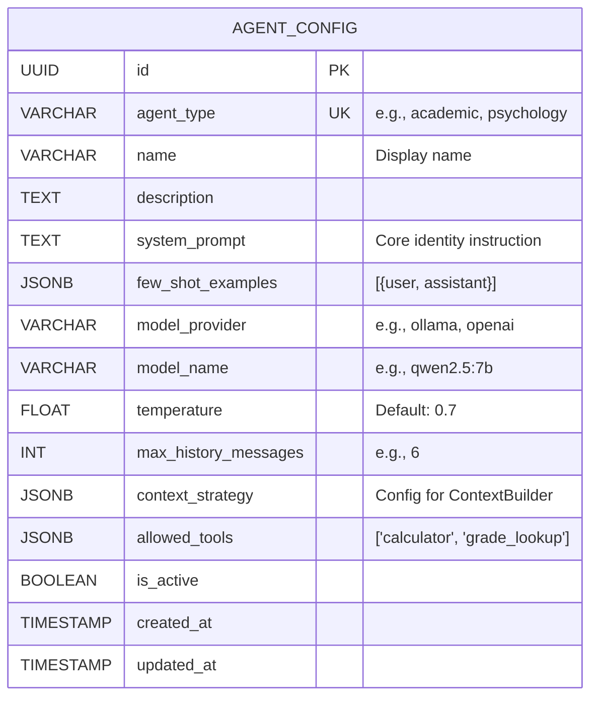
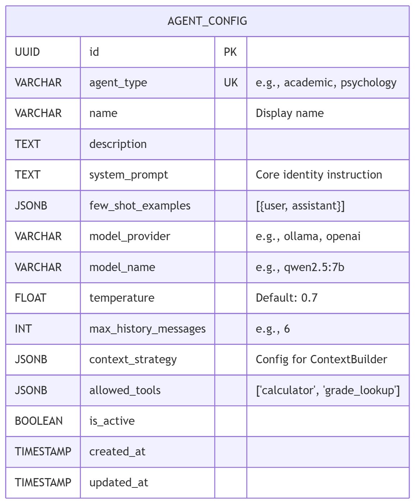
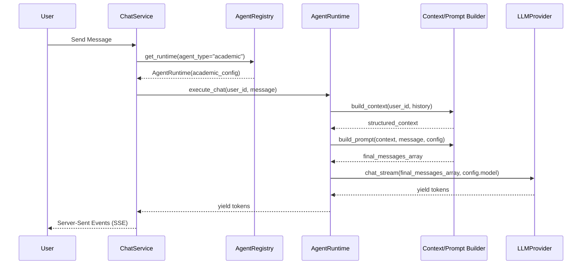
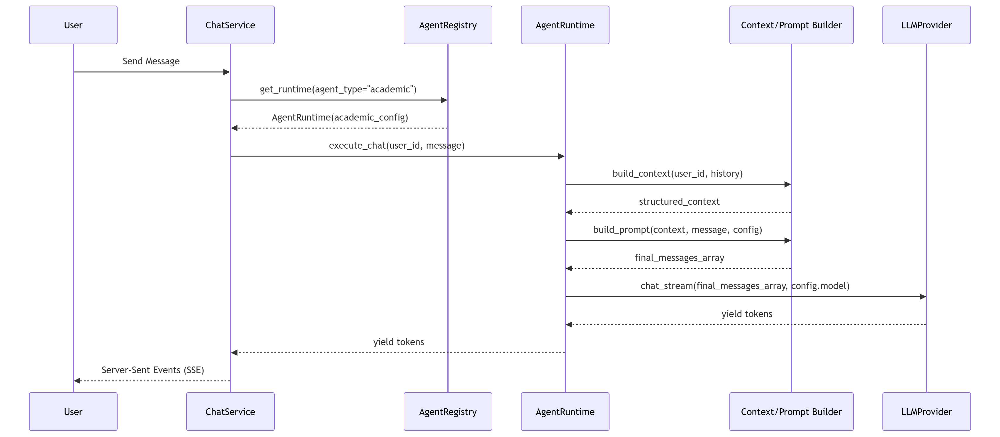

# THIẾT KẾ CORE AGENT RUNTIME (V2)

Tài liệu này đặc tả chi tiết 4 thành phần lõi của Agent System V2: Agent Configuration, Agent Runtime (bao gồm Registry), Context / Prompt System, và Model Provider.

---

## 1. AGENT CONFIGURATION

`AgentConfig` là bảng thiết kế (blueprint) tĩnh được nạp từ Database. Nó định nghĩa "Nhân cách" và "Giới hạn" của một Agent.

### Static Code vs Dynamic Config
- **PostgreSQL:** Các trường thông dụng dùng để query, index, quản lý lifecycle (id, agent_type, is_active, model_name).
- **JSONB (PostgreSQL):** Các cấu hình phức tạp, có thể mở rộng mà không cần sửa schema DB (few_shot_examples, allowed_tools, context_strategy).
- **Environment Variable (.env):** Các secret key, API URL (LLM_BASE_URL, REDIS_URL) - Tuyệt đối không lưu URL cứng vào DB.

### ERD Schema Diagram (Mermaid)

Xem ảnh tại đây: 

---

## 2. AGENT REGISTRY & AGENT RUNTIME

### Agent Registry (Factory)
Đóng vai trò Cửa ngõ (Gateway). Không chứa bất kỳ câu lệnh `if agent_type == "academic"` nào.

**Lifecycle:**
1. Nhận `agent_type` từ Intent Router.
2. Query `AgentConfigRepository` -> Lấy `AgentConfig`.
3. Nếu config không tồn tại / `is_active=False` -> Bật **Fallback Strategy** (trả về General Config mặc định).
4. Khởi tạo và trả về instance `AgentRuntime(config)`.

### Agent Runtime
Trái tim của hệ thống thực thi. `AgentRuntime` là một class duy nhất (không thừa kế phân mảnh).
**Trách nhiệm (Responsibilities):**
- Tiếp nhận Request (User message, Session ID).
- Gọi `ContextBuilder` lấy bối cảnh.
- Gọi `PromptBuilder` trộn Prompt.
- Gọi `ModelProvider` để lấy kết quả.
- (Tương lai) Loop gọi Tool nếu LLM sinh ra Tool Call Request.
- Stream dữ liệu về Client.

Xem ảnh tại đây: 

---

## 3. CONTEXT & PROMPT SYSTEM

### ContextBuilder
Loại bỏ hardcode `history[-6:]`. ContextBuilder hoạt động dựa trên `config.context_strategy` (được lưu bằng JSON).
- Nếu `strategy == "strict_recent"`, lấy `N` tin nhắn gần nhất.
- Truy vấn DB lấy `StudentProfile`, `AcademicStatistic`... (Chỉ lấy những gì được cấp quyền trong cấu hình).
- Đóng gói (Structured) bối cảnh gọn gàng.

### PromptBuilder
Tuyệt đối không để `AgentRuntime` tự nối chuỗi (String Concatenation). `PromptBuilder` chịu trách nhiệm lắp ráp theo đúng chuẩn Message format của OpenAI/Ollama API:
1. `{"role": "system", "content": SYSTEM_PROMPT}`
2. Thêm Tool Instructions (nếu có allowed_tools).
3. Đắp bối cảnh: `{"role": "system", "content": "Context:..."}`
4. Vòng lặp Few-Shot (Mô phỏng role user/assistant để mồi AI).
5. Vòng lặp History (Lịch sử chat thật của User).
6. Mới nhất: `{"role": "user", "content": CURRENT_MESSAGE}`

---

## 4. MODEL PROVIDER & CONFIGURATION

### Abstraction
Hệ thống sử dụng Interface `LLMProvider`:
- `async def chat(messages, config) -> ChatResponse`
- `async def chat_stream(messages, config) -> AsyncGenerator`

Nhờ thiết kế này, **Academic Agent** có thể dùng `Gemma` trong khi **Psychology Agent** có thể dùng `Qwen`. `AgentRuntime` chỉ cần ném cục `config` cho `LLMProvider`, Provider sẽ tự động trỏ tới Model tương ứng (mà không cần sửa 1 dòng code Python).

---

## 5. ERROR HANDLING & FALLBACKS

- **Config không tồn tại / Disabled:** Fallback về "GeneralAgent" config mặc định.
- **Model Offline / Timeout:** Bắt Exception tại `LLMProvider`. Trả về message xin lỗi thân thiện: *"Hệ thống đang quá tải, vui lòng thử lại sau"*. Tránh crash toàn bộ backend.
- **Context quá dài (Vượt max token):** `ContextBuilder` tự động prune (xóa bớt) history cũ nhất để bảo vệ an toàn cho Model Context Window.

---

## 6. TESTABILITY (MOCKING)

Kiến trúc rời rạc cho phép viết Unit Test hoàn toàn độc lập (không cần bật server Ollama):
- **Mock LLMProvider:** Giả lập hành vi trả về chuỗi text fix cứng để test luồng parse của `AgentRuntime`.
- **Test ContextBuilder:** Đưa vào Fake Database Session, kiểm tra xem mảng message build ra có chính xác không (không liên quan gì đến LLM).
