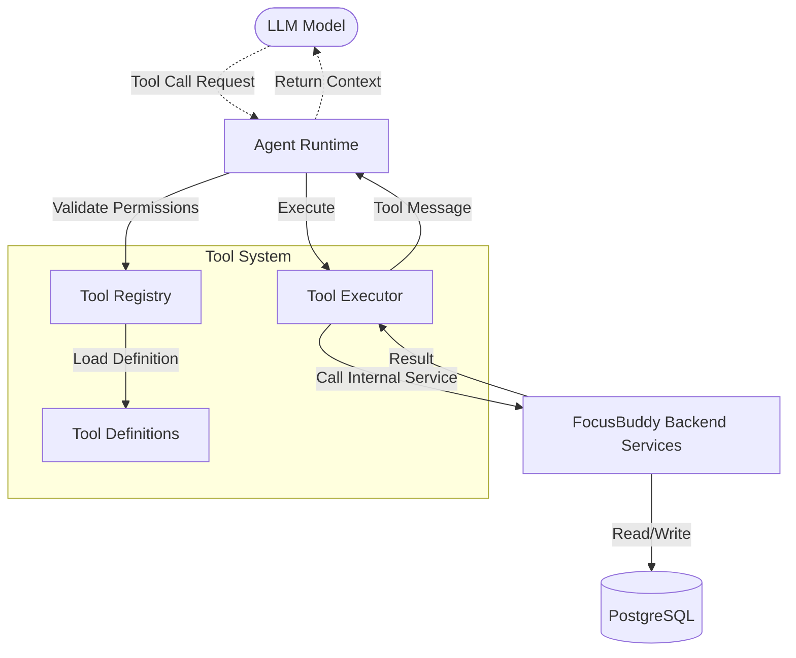
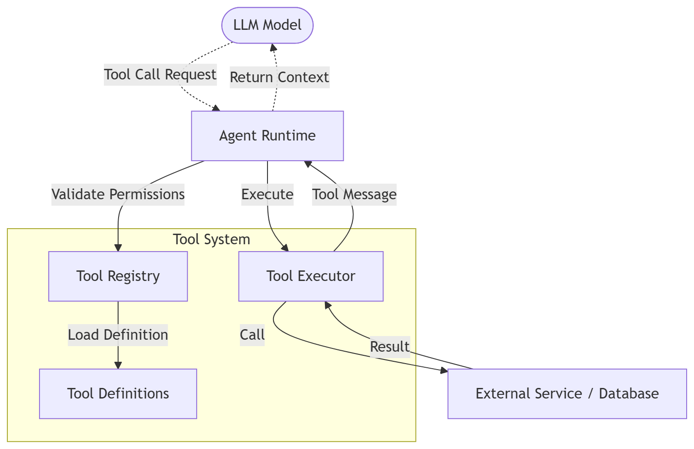

# TOOL ARCHITECTURE OVERVIEW

Tài liệu này trình bày kiến trúc tổng thể của Hệ thống Công cụ (Tool System) dành cho Agent V2. Mục tiêu là tách biệt hoàn toàn giữa **Quyết định của LLM (WHAT)** và **Thực thi của Backend (HOW)**.

## 1. Kiến trúc Cốt lõi (Core Architecture)

Xem ảnh tại đây: 

## 2. Các Thành Phần Chính
- **Tool Definition (Contract):** Đặc tả (schema) của một công cụ (tên, mô tả, tham số đầu vào, đầu ra). Định dạng chuẩn theo OpenAI Function Calling schema.
- **Tool Registry:** Nơi đăng ký toàn bộ công cụ có trong hệ thống. Cung cấp API để `AgentRuntime` tra cứu công cụ theo tên, đồng thời filter ra các công cụ mà cấu hình `AgentConfig` cho phép (`allowed_tools`).
- **Tool Executor:** Chịu trách nhiệm gọi code Python thực sự. Executor ĐƯỢC ƯU TIÊN gọi các **Internal Backend Services** của hệ thống (Ví dụ: `study_session_service`) thay vì gọi thẳng CSDL hoặc API bên ngoài.

## 3. Phân Loại Tool (Taxonomy)
Dựa theo thiết kế hệ thống robot, Tool được chia làm 3 loại:
1. **INTERNAL_CAPABILITY:** Công cụ gọi trực tiếp Internal Service (Ví dụ: `schedule.create`, `academic.get_gpa`). Đây là các tool chủ đạo.
2. **EXTERNAL_TOOL:** Công cụ gọi API ngoài (Ví dụ: `google_calendar.sync`, `weather.current`). Chỉ dùng khi FocusBuddy thực sự không có data đó.
3. **MODEL_NATIVE:** Năng lực tự thân của LLM (Suy luận, kiến thức chung). Không cần định nghĩa tool.

## 4. An Toàn & Phân Quyền (Security & Permissions)
Agent không được tự do truy cập mọi Tool. Bảng `agent_configs` trong DB chứa cột `allowed_tools` (ví dụ: `["calculator", "grade_analysis"]`). `ToolRegistry` sẽ chặn mọi nỗ lực gọi Tool ngoài danh sách này, ngăn chặn hiện tượng AI tự ý thực hiện các hành động phá hoại.
LLM chỉ truyền Tham số (Parameters), việc xác thực (Authorization) thuộc quyền của Internal Services.

## 5. Cập Nhật Mới (Capability Reassessment)
Vui lòng tham khảo file `FOCUSBUDDY_CAPABILITY_MATRIX.md` để xem danh sách chi tiết các tính năng ưu tiên nội bộ thay vì dùng External Tools (đặc biệt là việc loại bỏ Google Calendar làm primary database).
