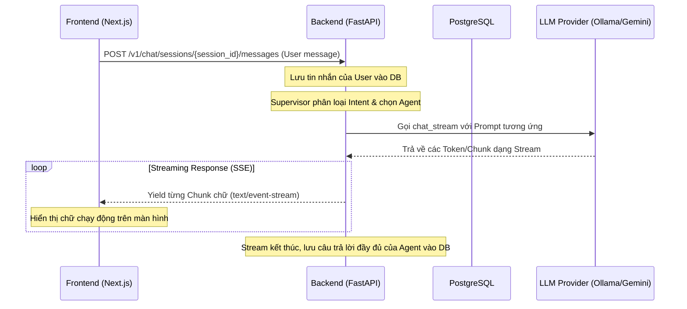

# PHÂN TÍCH TÍCH HỢP HỆ THỐNG CHAT BOX (FOCUSBUDDY AI CHATBOT)

Tài liệu này phân tích kiến trúc hiện tại của tính năng Chat Box, đánh giá tính sẵn sàng của chức năng kết nối giữa Frontend và Backend, đồng thời chỉ ra các lỗi đồng bộ dữ liệu và đề xuất phương án giải quyết chi tiết.

---

## 1. Kiến Trúc Luồng Dữ Liệu (Data Flow)

Hệ thống Chatbot được thiết kế theo mô hình **Streaming qua Server-Sent Events (SSE)** nhằm nâng cao trải nghiệm người dùng (UX) thông qua việc hiển thị câu trả lời dạng gõ chữ thời gian thực (real-time typing effect).



---

## 2. Chi Tiết Các Thành Phần Liên Quan

Hệ thống Chatbot hiện được triển khai thông qua các file nguồn sau:

### Backend (`be`)
* **Endpoint API**: [chat.py](file:///g:/Chat%20Box/be/app/api/v1/chat.py)
  - Khai báo route `POST /sessions/{session_id}/messages` trả về một `StreamingResponse` với `media_type="text/event-stream"`.
* **Logic Service**: [chat_service.py](file:///g:/Chat%20Box/be/app/services/module_5_ai_chatbot/chat_service.py)
  - Hàm `add_message_and_reply_stream`: 
    1. Lưu tin nhắn của User vào Postgres qua Repository.
    2. Gọi `Supervisor` để phân tích Intent và chọn `agent_type`.
    3. Khởi tạo `AgentRuntime` tương ứng từ `AgentRegistry`.
    4. Sử dụng `async for chunk in runtime.execute_chat(...)` để liên tục yield các chunk chữ.
    5. Sau khi stream hoàn tất, gom toàn bộ nội dung text (`full_reply`) và lưu thành tin nhắn của AI vào DB.

### Frontend (`fe`)
* **Trang Giao Diện**: [page.tsx](file:///g:/Chat%20Box/fe/src/app/%28app%29/chatbot/page.tsx)
  - Trang quản lý các session chat, danh sách tin nhắn, khung nhập liệu và hiển thị tin nhắn.
* **API Client**: [services.ts](file:///g:/Chat%20Box/fe/src/lib/services.ts)
  - Khai báo hàm `chatService.sendMessage` sử dụng Axios instance:
    ```typescript
    sendMessage: (sessionId: string, data: ChatMessageCreate) =>
      api.post<ChatMessage>(`/v1/chat/sessions/${sessionId}/messages`, data),
    ```

---

## 3. Đánh Giá Trạng Thái Kết Nối & Tích Hợp Trên Frontend (FE Connection Evaluation)

> [!WARNING]
> **Tình Trạng: CHƯA HOẠT ĐỘNG ĐÚNG (KẾT NỐI BỊ LỖI)**
> 
> Mặc dù cả Frontend và Backend đều đã có code xử lý, nhưng **chức năng chat chưa được kết nối đúng cách** do có sự xung đột lớn về giao thức truyền tải dữ liệu giữa client và server.

### Các vấn đề cụ thể:
1. **Xung đột kiểu truyền tải (Streaming vs Standard POST)**:
   - Backend trả về dữ liệu dạng **Streaming Stream** (`text/event-stream`).
   - Frontend lại sử dụng **Axios** (`api.post`) thông thường. Axios theo cấu hình mặc định sẽ đợi cho tới khi toàn bộ kết nối đóng lại (stream kết thúc) rồi mới trả về kết quả. Điều này làm mất hoàn toàn hiệu ứng gõ chữ (Streaming UI).
2. **Lỗi parse dữ liệu (JSON Parsing Error)**:
   - Khi stream kết thúc, Axios cố gắng chuyển đổi (parse) kết quả nhận được sang kiểu dữ liệu JSON vì cấu hình header mặc định là `'Content-Type': 'application/json'`.
   - Vì Backend liên tục yield ra các chunk chữ thô (ví dụ: `Chào`, ` bạn`, `!`), kết quả nhận được cuối cùng chỉ là một chuỗi văn bản dài ghép lại (`Chào bạn!`) chứ không phải một cấu trúc JSON hợp lệ dạng `ChatMessage`.
   - Kết quả là Axios sẽ ném ra lỗi parse hoặc trả về dữ liệu thô dạng string. Khi `page.tsx` thực hiện:
     ```typescript
     setMessages((prev) => [...prev.filter((m) => m.id !== userMessage.id), userMessage, res.data]);
     ```
     Dữ liệu `res.data` lúc này không phải là object chứa các thuộc tính `{ id, content, sender_type, created_at }`, dẫn đến lỗi giao diện (Crash / Render sai thông tin / Không hiển thị tin nhắn).

---

## 4. Giải Pháp Khắc Phục (Proposed Solutions)

Để kết nối hoạt động trơn tru và hỗ trợ hiển thị dạng Streaming động như thiết kế, chúng ta bắt buộc phải refactor lại cách nhận tin nhắn phía Frontend.

### Giải pháp đề xuất: Sử dụng Web Streams API (`fetch`)

Thay vì dùng Axios để gửi tin nhắn chat, ta sử dụng API `fetch` gốc của trình duyệt để đọc stream thông qua `ReadableStreamReader`.

#### Code mẫu thay thế hàm `handleSend` trong [page.tsx](file:///g:/Chat%20Box/fe/src/app/%28app%29/chatbot/page.tsx):

```typescript
  const handleSend = async () => {
    if (!input.trim() || loading) return;

    let sessionId = activeSession;

    // Tự động tạo session nếu chưa có
    if (!sessionId) {
      try {
        const res = await chatService.createSession('Cuộc hội thoại mới');
        setSessions([res.data, ...sessions]);
        sessionId = res.data.id;
        setActiveSession(sessionId);
      } catch {
        return;
      }
    }

    const userMessage: ChatMessage = {
      id: `temp-user-${Date.now()}`,
      session_id: sessionId,
      sender_type: 'USER',
      content: input,
      message_type: 'TEXT',
      created_at: new Date().toISOString(),
    };

    // Thêm tin nhắn của User vào danh sách hiển thị
    setMessages((prev) => [...prev, userMessage]);
    setInput('');
    setLoading(true);

    // Khởi tạo một tin nhắn trống cho Bot để nhận stream
    const botMessageId = `temp-bot-${Date.now()}`;
    const initialBotMessage: ChatMessage = {
      id: botMessageId,
      session_id: sessionId,
      sender_type: 'BOT',
      content: '',
      message_type: 'TEXT',
      created_at: new Date().toISOString(),
    };
    setMessages((prev) => [...prev, initialBotMessage]);

    try {
      // Sử dụng fetch thay vì Axios để có thể xử lý stream
      const API_BASE_URL = process.env.NEXT_PUBLIC_API_URL || 'http://localhost:8000/api';
      const userId = localStorage.getItem('focusbuddy_user_id') || '';

      const response = await fetch(`${API_BASE_URL}/v1/chat/sessions/${sessionId}/messages`, {
        method: 'POST',
        headers: {
          'Content-Type': 'application/json',
          'x-user-id': userId,
        },
        body: JSON.stringify({
          content: userMessage.content,
          message_type: 'TEXT',
        }),
      });

      if (!response.ok) throw new Error('Network response was not ok');
      if (!response.body) throw new Error('No response body for streaming');

      const reader = response.body.getReader();
      const decoder = new TextDecoder();
      let done = false;
      let botContent = '';

      while (!done) {
        const { value, done: doneReading } = await reader.read();
        done = doneReading;
        if (value) {
          const chunk = decoder.decode(value, { stream: !done });
          botContent += chunk;
          
          // Cập nhật nội dung Bot message liên tục theo từng chunk chữ
          setMessages((prev) =>
            prev.map((msg) =>
              msg.id === botMessageId ? { ...msg, content: botContent } : msg
            )
          );
        }
      }
      
      // Reload lại danh sách tin nhắn chuẩn từ DB sau khi stream kết thúc để đồng bộ ID thật
      const resMessages = await chatService.getMessages(sessionId);
      setMessages(resMessages.data);
      
    } catch (err) {
      console.error('Lỗi khi stream chat:', err);
      // Hiển thị tin nhắn lỗi
      setMessages((prev) =>
        prev.map((msg) =>
          msg.id === botMessageId
            ? { ...msg, content: 'Xin lỗi, đã xảy ra lỗi khi kết nối với AI Study Buddy. Vui lòng thử lại.' }
            : msg
        )
      );
    } finally {
      setLoading(false);
    }
  };
```
