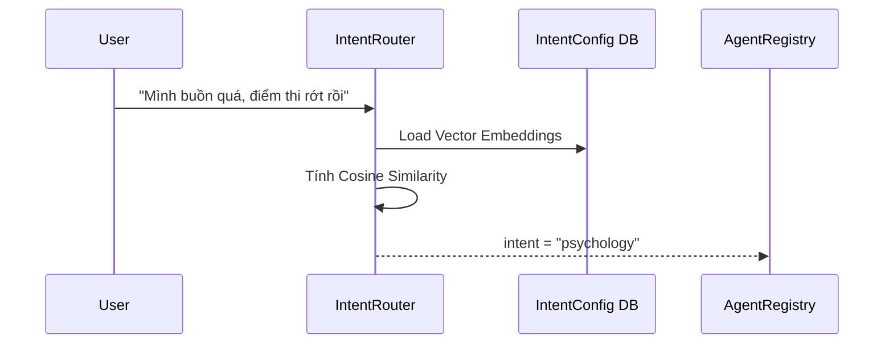

# SUPERVISOR & INTENT ROUTER

`Supervisor` là hệ thống gác cổng đầu tiên của FocusBuddy. Nhiệm vụ duy nhất của nó là nhận phân tích ngữ nghĩa (Semantic Analysis) câu nói của người dùng và điều hướng (Routing) tới đúng Agent xử lý.

## 1. Vai trò của Supervisor
- **Chỉ làm:** Phân loại Intent, xác định `agent_type`, và Dispatch (chuyển tiếp) Message tới Agent Registry.
- **Không làm:** Không sinh ra câu trả lời cuối cùng, không execute tools, không giữ Prompt của từng Agent (Việc này do AgentRuntime lo).

## 2. Intent Router (Embedding-based)
Thay vì dùng LLM tốn kém để phân loại, ta sử dụng NLP Embedding (Ví dụ: `paraphrase-multilingual-MiniLM-L12-v2`).

## 3. Dynamic Configuration
Thay vì gán cứng bộ từ điển `INTENT_SAMPLES = {...}` trong code, thông tin này sẽ được lưu ở bảng `intent_configs`.
- `intent_configs` (id, agent_type, example_phrases, is_active).
Mỗi khi hệ thống start hoặc khi Admin thêm câu mẫu mới, hệ thống sẽ tự sinh Vector Embeddings và nạp vào RAM. Điều này giúp hệ thống học hỏi liên tục mà không cần khởi động lại.
