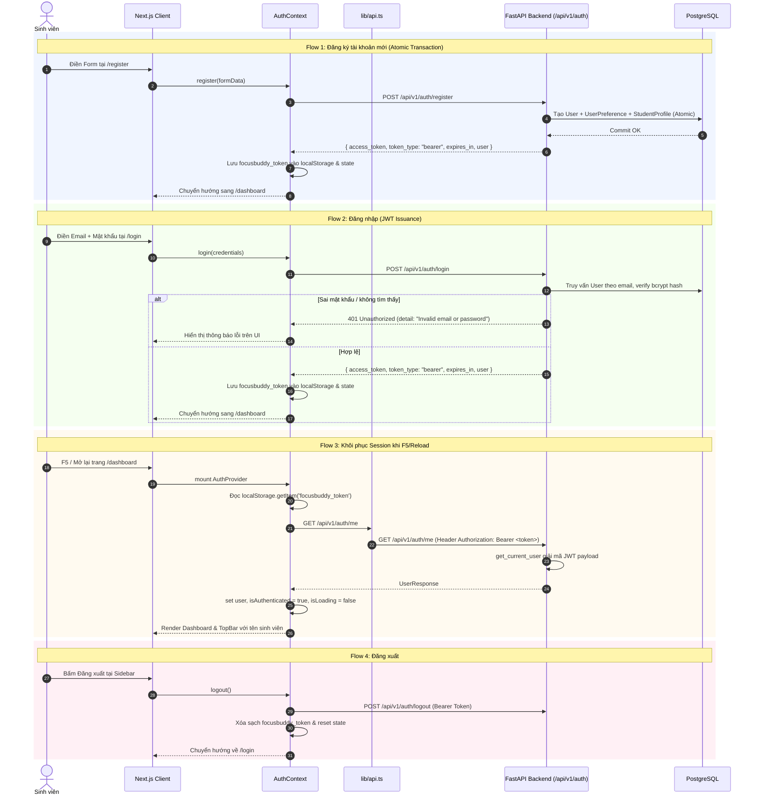
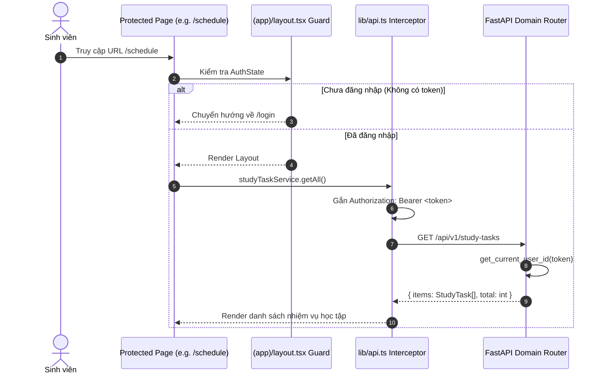
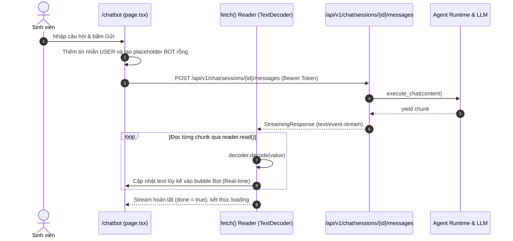

# Frontend - Backend API Interaction Flows

> **Project:** FocusBuddy  
> **Auth Architecture:** JWT Bearer Authentication (`Authorization: Bearer <token>`)  
> **Status:** SYNCHRONIZED  

---

## 1. Authentication & Registration Flow

---

## 2. Business APIs & Route Guard Flow

---

## 3. Chatbot Streaming Interaction Flow

